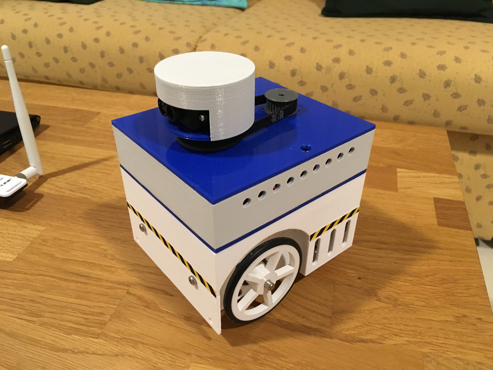

# StepperBotLidar2

Rotating 360 degree Lidar based on the TF Mini sensor. This is a part of a larger robot project. 
The whole rover is "layered" in three slices:

- the chassis layer: https://github.com/Brezensalzer/StepperBotChassis
- the control layer: https://github.com/Brezensalzer/StepperBotController
- the sensor layer: https://github.com/Brezensalzer/StepperBotLidar2
- the ground station code: https://github.com/Brezensalzer/StepperBotGroundStation (with BreezySLAM support!)

Arduino Code is for a Bluepill board but should be easily adaptable to other boards. 
Openscad, FreeCAD drawings and STL files are provided for 3D printing.

To complete the mechanical build, the following parts are needed:
- TF Mini Lidar
- Stepper motor 8HS11-0204S (bought from stepperonline)
- Pololu DRV8834 Low-Voltage Stepper Motor Driver Carrier
- Ball bearing SS6000ZZ 26x10x8 V2A
- ca. 2cm of 10mm aluminium pipe
- Slip ring with 12.5mm, 300rpm, 6 wires
- GT2 timing belt 200mm
- Optional: Pololu Mini Pushbutton Power Switch with Reverse Voltage Protection, LV

The drive pulley on the stepper motor has 30 teeth, the pulley on the turntable has 54 teeth. One full step (1.8°) of the stepper motor is transmitted to a 1° step on the turntable.

Short video clip: https://youtu.be/fx5sSlf0POA

  

